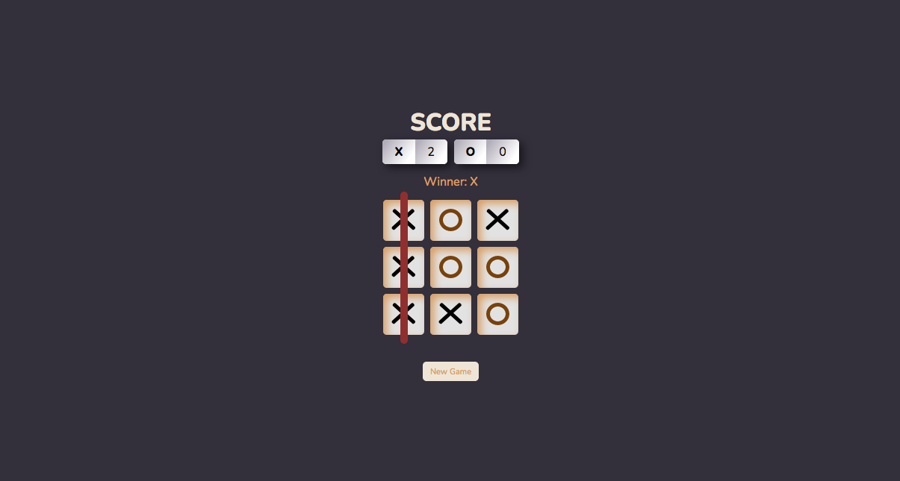

# Tic-Tac-Toe Game

This repository contains a Tic-Tac-Toe game created using React, HTML, CSS and Vite build tool.

## App preview

[https://tic-tac-toe-by-slavk.netlify.app/](https://tic-tac-toe-by-slavk.netlify.app/)

## Usage

You can use this repository to play Tic-Tac-Toe in the browser. To start you need to have **pnpm** package manager installed. Clone the repository and install the necessary dependencies using the command **pnpm install**. Then run the command **pnpm run dev** to launch the game in your browser.

**pnpm** was used as a solution to the **eslint** node module error. The module could not be installed with **npm** in a **Vite** project because of Mac OS version being outdated.

## Game Rules

This is a two-player game played on a 3x3 grid. The players take turns by placing their respective marks in an empty square of the grid. The first player to place three of their marks in a horizontal, vertical, or diagonal row wins the game. If all squares are filled and no player has won, the game ends in a tie. A winner's score is increased by 1 point.

## Code

The main logic of the game is in the **App.js** file. The game state is managed using React hooks, and the current state of the board, the current player, and the winner are stored as state variables. The game board is rendered using the **map()** method.

Each square is a **CSS Grid** element with a click event that triggers the **clickHandler()** function. The **calculateWinner()** function is called when a player makes a move, and checks for winning sequences. If a winning sequence is found, the winner is set and shown the status field and the game is over.

Alternatively, if all the squares are filled and there is no winner, the game ends in a tie. That is checked by **useEffect()** hook.

The game status is displayed using a conditional statement that checks for the winner or the next player, and the score is updated accordingly.

The **newGame()** function resets the board and the winner, and sets the player to the last winner if there was one. The **setScore()** function updates the score of the current player.

## Styling

The colors were picked by a generated color harmony at [Adobe Color Wheel](https://color.adobe.com/create/color-wheel). Decisions on visual and stylistic appearance were made at various stages of development.

## Contribution

Contributions to this repository are welcome. If you would like to contribute, please fork the repository and create a pull request with your changes.
